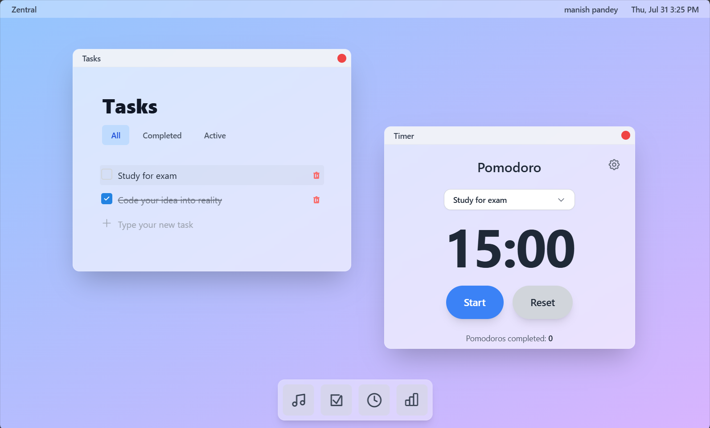

# Zentral

[]()
[]()
[](LICENSE)
[]()
[]()

A **modern productivity web application** that delivers a **desktop-like experience** in your browser.  
Zentral empowers you to **manage tasks, track your time, analyze productivity trends, and focus with ambient music** — all in one intuitive workspace.

---

## 📸 Demo Preview



---

## ✨ Features

### 🖥️ **Desktop-Inspired Interface**
- Resizable & draggable windows for a true multitasking feel
- Seamlessly open multiple productivity tools at once

### ✅ **Task Management**
- Create, edit, and organize your tasks with ease
- Filter by **All / Completed / Active**
- Integrated directly with the Pomodoro Timer

### ⏱️ **Pomodoro Timer**
- Customizable durations for work, short breaks, and long breaks
- Automatic session tracking linked to specific tasks
- Smart cycling between focus and rest periods
- Audio alerts upon session completion

### 📊 **Analytics Dashboard**
- Daily and historical productivity insights
- Beautiful charts & performance trends
- Measure task completion rate and focus time

### 🎵 **Ambient Music Player**
- Curated focus-enhancing soundscapes
- Integrated YouTube audio player with volume control
- Genre options: **lofi, jazz, nature, ambient, white noise**

### 🔐 **Secure Authentication**
- Google OAuth integration
- Protected user sessions and private data storage

---

## 🛠️ Technology Stack

| Category       | Technology |
|----------------|------------|
| **Frontend**   | React 19.1.0 (TypeScript) |
| **Build Tool** | Vite 7.0.0 |
| **Styling**    | Tailwind CSS 3.4.17 |
| **Auth**       | Firebase 11.10.0 (Google OAuth) |
| **Routing**    | React Router DOM 7.6.3 |
| **Charts**     | Recharts 3.1.0 |
| **Icons**      | Lucide React 0.534.0 |
| **Code Quality** | ESLint + Prettier |

---

## 🚀 Getting Started

### Prerequisites
- Node.js **v18+**
- npm or yarn package manager

### Installation

```bash
# Clone the repository
git clone https://github.com/thatsickusername/zentral.git
cd zentral

# Install dependencies
npm install
```

### Firebase Setup
1. Create a new project in [Firebase Console](https://console.firebase.google.com/).
2. Enable **Google Authentication**.
3. Create a `.env` file in the root directory and add your Firebase config variables:  
   *(Example: `VITE_FIREBASE_API_KEY`, `VITE_FIREBASE_AUTH_DOMAIN`, etc.)*
4. Do **not** commit `.env` files to version control.

### Run the development server
```bash
npm run dev
```

### Build for production
```bash
npm run build
```

---

## 📖 Usage Guide

1. **Sign In** → Authenticate via Google.
2. **Manage Tasks** → Create & organize your to-dos.
3. **Start a Pomodoro** → Focus with customizable work/break cycles.
4. **Track Performance** → Check analytics & session history.
5. **Enhance Focus** → Play ambient music in the background.

---

## 📁 Project Structure

```
src/
├── Pages/           # Main page components (Desktop, Login)
├── applications/    # Productivity apps (Tasks, Timer, Analytics, MusicPlayer)
├── components/      # UI components (Window, Dock, TopBar)
├── context/         # React Context providers
├── hooks/           # Custom React hooks
├── services/        # Firebase & external services
├── types/           # TypeScript definitions
└── utils/           # Helper utilities
```

---

## 🎯 Core Applications

### **Tasks**
A powerful task manager with Pomodoro integration.

### **Timer**
Fully customizable Pomodoro timer with automatic session logging.

### **Analytics**
Visual insights into productivity trends and daily focus performance.

### **Music Player**
Curated background music and YouTube-based ambient audio playback.

---

## 🤝 Contributing

We welcome contributions!  
1. Fork the repository  
2. Create a feature branch:  
   ```bash
   git checkout -b feature/amazing-feature
   ```
3. Commit your changes:  
   ```bash
   git commit -m "Add amazing feature"
   ```
4. Push to your branch:  
   ```bash
   git push origin feature/amazing-feature
   ```
5. Open a Pull Request 🎉

---

## 🧹 Development Commands

```bash
npm run lint       # Run ESLint checks
npm run lint:fix   # Auto-fix lint issues
npm run format     # Format with Prettier
```

---

## 📄 License

This project is licensed under the [MIT License](LICENSE).

---

**Zentral** — *Stay focused. Get things done.*
